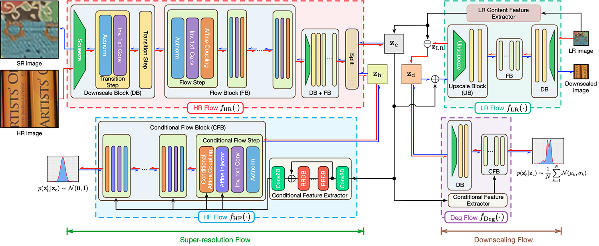
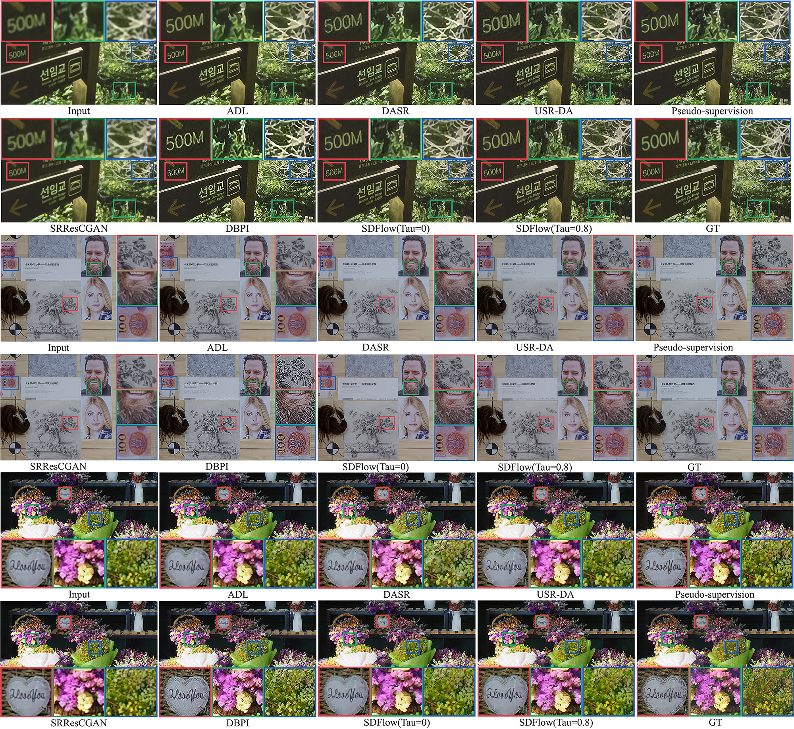
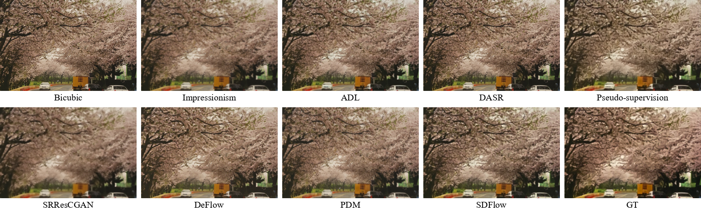

# SDFlow: Learning Many-to-Many Mapping for Unpaired Real-World Image Super-resolution and Downscaling

## Abstract

Learning based single image super-resolution (SISR) for real-world images has been an active research topic yet a challenging task, due to the lack of paired low-resolution (LR) and high-resolution (HR) training images. Most of the existing unsupervised real-world SISR methods adopt a two-stage training strategy by synthesizing realistic LR images from their HR counterparts first, then training the super-resolution (SR) models in a supervised manner. However, the training of image degradation and SR models in this strategy are separate, ignoring the inherent mutual dependency between downscaling and its inverse upscaling process. Additionally, the ill-posed nature of image degradation is not fully considered. In this paper, we propose an image downscaling and SR model dubbed as SDFlow, which simultaneously learns a bidirectional many-to-many mapping between real-world LR and HR images unsupervisedly. The main idea of SDFlow is to decouple image content and degradation information in the latent space, where content information distribution of LR and HR images is matched in a common latent space. Degradation information of the LR images and the high-frequency information of the HR images are fitted to an easy-to-sample conditional distribution. Experimental results on real-world image SR datasets indicate that SDFlow can generate diverse realistic LR and SR images both quantitatively and qualitatively.

## Key Features

- **Bidirectional Mapping**: Learns a many-to-many mapping between LR and HR images.
- **Unsupervised Learning**: Operates without the need for paired training images.
- **Latent Space Decoupling**: Separates content and degradation information for better modeling.
- **Diverse Outputs**: Generates multiple realistic LR and SR images.

## Methodology

### Overview
SDFlow aims to map real-world LR and HR images to a shared latent space by decoupling image content from degradation information. This allows the generation of diverse, realistic LR and SR images. The method is illustrated in the figure below:



### Key Components

1. **Latent Space Decoupling**:
    - LR images are represented by content and degradation latent variables.
    - HR images are decoupled into content and high-frequency (HF) components.
    - Content variables of LR and HR images are mapped to a shared latent space.

2. **Normalizing Flow Framework**:
    - SDFlow uses a series of invertible transformations to map complex distributions to simple, tractable ones.
    - This enables efficient sampling and density evaluation, facilitating diverse image generation.

3. **Unified Training**:
    - The model is trained jointly for both downscaling and SR tasks, ensuring consistency and improving performance.

## Experimental Results

### Qualitative Evaluation
Visual comparisons highlight SDFlow's ability to produce high-quality, perceptually realistic images. Examples are shown below:

#### Super-resolution Examples


#### Downscaling Examples


## Inference
### Pre-trained models
You can download the pre-trained models from [here](https://mega.nz/folder/f7QWBLqA#bAijxQ2iGF1PsSgK1Qm38w).

	python3 sdflow_sr.py --lr_imgs_path path_to_lr_images --output_path path_for_sr_images --pretrained_model_path path_to_pretrained_models --tau sampling_temperature
	python3 sdflow_ds.py --hr_imgs_path path_to_hr_images --output_path path_for_downscaled_images --pretrained_model_path path_to_pretrained_models --tau sampling_temperature


If you find our work useful in your research or publication, please cite our work:

```
@article{sun2023sdflow,
  title={Learning Many-to-Many Mapping for Unpaired Real-World Image Super-resolution and Downscaling},
  author={Wanjie Sun and Zhenzhong Chen},
  journal={arXiv preprint arXiv:2310.04964},
  year={2023}
}
```

## Full code include training scripts will be available later.
